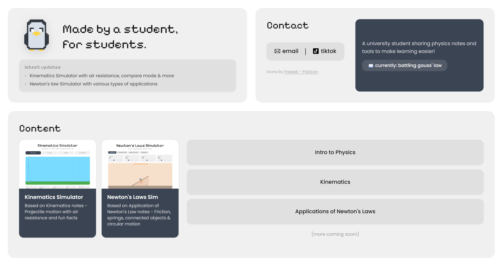

# learning with a penguin

[](https://mtysac.github.io/physics-notes/)
[](LICENSE)
[](https://github.com/mtysac/physics-notes/actions/workflows/lint.yml)

a website i made to share my physics notes and some interactive simulators. started it mostly so i could refer to notes without storage limits but figured it could be useful for other students too.

**live site:** https://learningwithapenguin.vercel.app/



## what's on the site

**notes** (notes written in onenote and notion but there is a notes file with html pages written with KaTeX)
- intro to physics
- kinematics
- applications of newton's laws

**simulators**
- kinematics simulator — projectile motion with adjustable speed, angle, gravity, air resistance, compare mode, etc.
- newton's laws simulator — covers inclined plane, connected objects, spring (hooke's law), and circular motion

## stack

- html
- css
- javascript
- eslint (dev)

## how it works

the site is a single page layout — no routing, no backend, everything is static.

`index.html` is the main page. it uses a css grid to split into three sections: hero (top left), contact (top right), and content (bottom). on mobile it stacks vertically via a media query.

the two simulators are separate html pages (`kinematics-sim.html` and `newtons-sim.html`), each with their own css and js files. all the physics and drawing is done on an html canvas using the 2d context api.

**kinematics simulator** (`js/kinematics-sim.js`) — runs projectile motion. physics is solved analytically when there's no drag, or numerically with euler integration when air resistance is on. the penguin is drawn with `drawImage` and rotated each frame to match the velocity vector angle.

**newton's laws simulator** (`js/newtons-sim.js`) — four modes sharing the same canvas and ui. each mode has its own draw and physics functions. the spring uses euler integration with a damping term to simulate oscillation. circular motion runs a continuous `requestAnimationFrame` loop. inclined plane and connected objects are static and just redraw on slider input.

styling is split across `css/style.css` (main page), `css/mediaqueries.css` (mobile breakpoints), `css/kinematics-sim.css`, `css/newtons-sim.css`, and `notes/notes.css` (shared notes stylesheet).

## running it locally

open `index.html` in a browser, that's it.

to run the linter:
```bash
npm install
npm run lint
```

eslint is used to catch unused variables, potential bugs, and keep the js consistent across files. it doesn't change anything but flags issues.

## notes

still adding topics as i go through my courses. if something's wrong or missing feel free to reach out.

## contributing

see [CONTRIBUTING.md](CONTRIBUTING.md)

## license

[MIT](LICENSE)
